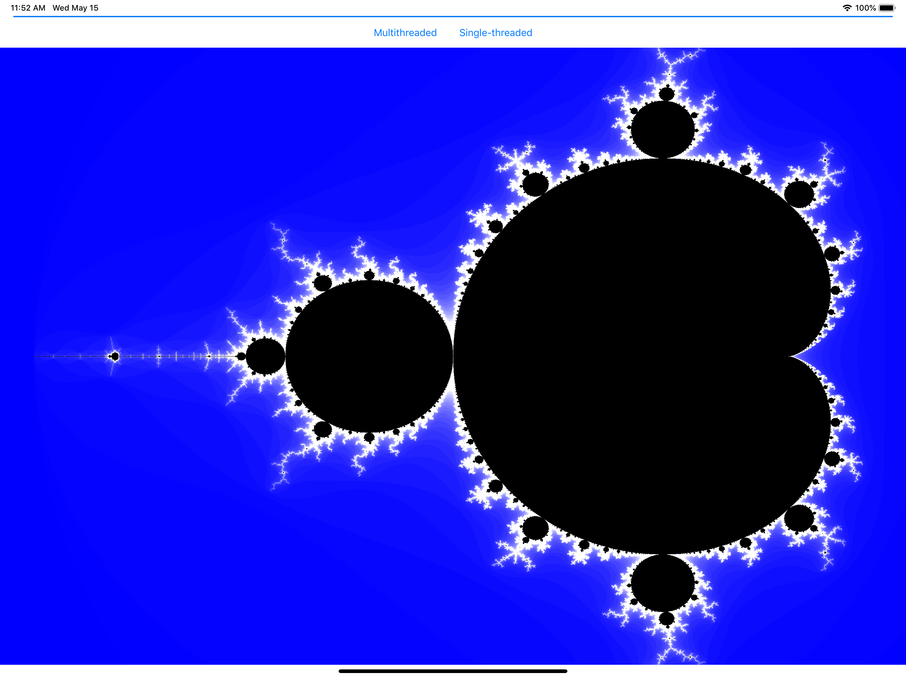

##  Simple Mandelbrot

This is a macOS and iOS implementation of Mandelbrot set. This uses `concurrentPerform` to parallelize the calculation. The custom [`chunkedConcurrentPerform`](https://github.com/robertmryan/Mandelbrot/blob/master/Common/Services/DispatchQueue%2BChunked.swift) strides through the iterations to mitigate the overhead associated with too many iterations doing too little work.

Developed in Swift on Xcode 16 and Swift 6. But the basic ideas are equally applicable for different versions of Swift.

### License

Copyright &copy; 2019 Robert Ryan. All rights reserved.

This work is licensed under a [Creative Commons Attribution-ShareAlike 4.0 International License](https://creativecommons.org/licenses/by-sa/4.0/).

---

13 May 2019
